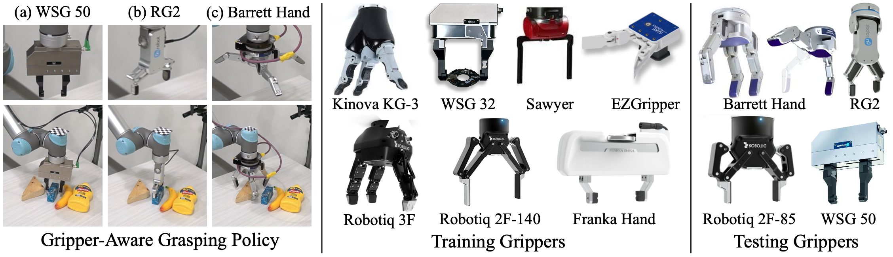

# AdaGrasp:  Learning  an  Adaptive  Gripper-Aware  Grasping  Policy

[Zhenjia Xu](http://www.zhenjiaxu.com/),
[Beichun Qi](https://www.linkedin.com/in/beichun-qi/),
[Shubham Agrawal](https://submagr.github.io/),
[Shuran Song](https://www.cs.columbia.edu/~shurans/)
<br>
Columbia University
<br>
[ICRA 2021](https://www.ieee-icra.org/)

### [Project Page](https://adagrasp.cs.columbia.edu/) | [Video](https://youtu.be/kknTYTbORfs) | [arXiv](https://arxiv.org/abs/2011.14206)

## Overview
This repo contains the PyTorch implementation for paper "AdaGrasp:  Learning  an  Adaptive  Gripper-Aware  Grasping  Policy".


## Content

- [Prerequisites](#prerequisites)
- [Data Preparation](#data-preparation)
- [Testing](#testing)
- [Training](#training)

## Prerequisites

The code is built with Python 3.6. Libraries are listed in [requirements.txt](requirements.txt) and can be installed with pip by:
```
pip install -r requirements.txt
```

## Data Preparation

The training and testing datasets generated from Dexnet 2.0 can be download here:
- [train](https://adagrasp.cs.columbia.edu/download/data/train.zip):  801 objects, 400 from the 3DNet subset and 401 from the Kit subset.
- [test](https://adagrasp.cs.columbia.edu/download/data/test.zip): 57 objects, 13 from Adversarial subset and the remaining objectfrom the Kit category that are not used in training.

Download, unzip, and organize as follows:
```
\adagrasp
    \data
        \dexnet
            \train
                ...
            \test
                ...
```

## Testing

### Pretrained Models
Pretrained models are provided in [pretrained_models](pretrained_models). 

### Testing Options
Various testing options can be modified or toggled on/off with different flags (run `python test.py -h` to see all options):
```
usage: test.py [-h] [--mode {fixed_gripper,select_gripper}] [--save SAVE]
               [--gui] [--gpu GPU] [--seed SEED] [--n_test N_TEST]
               [--n_vis_stored N_VIS_STORED]
               [--gripper_types GRIPPER_TYPES [GRIPPER_TYPES ...]]
               [--num_open_scale NUM_OPEN_SCALE]
               [--min_open_scale MIN_OPEN_SCALE]
               [--max_open_scale MAX_OPEN_SCALE] [--random_open_scale]
               [--target_num TARGET_NUM] [--obstacle_num OBSTACLE_NUM]
               [--seq_len SEQ_LEN] [--category_name CATEGORY_NAME]
               [--num_cam NUM_CAM]
               [--model_type {adagrasp,adagrasp_init_only,scene_only}]
               [--num_rotations NUM_ROTATIONS]
               [--load_checkpoint LOAD_CHECKPOINT]
```

`[CATEGORY_NAME]` is object category which can be chosen from [`train`, `test`].

`[GRIPPER_TYPES]` is a list of gripper name(str) separated by space, containing one or more from:
```
# training grippers
wsg_32 sawyer franka robotiq_2f_140 ezgripper kinova_3f robotiq_3f

#testing grippers
wsg_50 rg2 robotiq_2f_85 barrett_hand_2f barrett_hand-0 barrett_hand-0.1
```

### Testing Scripts
Here we provide several testing scripts to reproduce the results in paper.

- Single Object + Single Camera
    ```
    # AdaGrasp (testing grippers)
    python test.py --model_type adagrasp --mode select_gripper --load_checkpoint pretrained_models/adagrasp.pth --category_name [CATEGORY_NAME] --gripper_types wsg_50 rg2 robotiq_2f_85 barrett_hand_2f barrett_hand-0 barrett_hand-0.1

    # AdaGrasp-fixGripper
    python test.py --model_type adagrasp --mode fixed_gripper --load_checkpoint pretrained_models/adagrasp.pth --category_name [CATEGORY_NAME] --gripper_types [GRIPPER_TYPES]

    # AdaGrasp-fixConfig
    python test.py --model_type adagrasp --mode fixed_gripper --load_checkpoint pretrained_models/adagrasp.pth --category_name [CATEGORY_NAME] --gripper_types [GRIPPER_TYPES] --random_open_scale

    # AdaGrasp-initOnly
    python test.py --model_type adagrasp_init_only --mode fixed_gripper --load_checkpoint pretrained_models/adagrasp_init_only.pth --category_name [CATEGORY_NAME] --gripper_types [GRIPPER_TYPES] --random_open_scale

    # SceneOnly
    python test.py --model_type scene_only --mode fixed_gripper --load_checkpoint pretrained_models/scene_only.pth --category_name [CATEGORY_NAME] --gripper_types [GRIPPER_TYPES] --random_open_scale
    ```

- Multiple Objects

    Add the following options after each script:
    ```
    --n_test 50 --target_num 5 --obstacle_num 0 --seq_len 5
    ```

- Multiple Objects with Obstacles

    1. Add the following options after each script:
    ```
    --n_test 50 --target_num 3 --obstacle_num 3 --seq_len 3
    ```
    2. Load checkpoint with `_obstacle` as the suffix, for example:
    ```
    --load_checkpoint pretrained_models/adagrasp_obstacle.pth
    ```

- Multiple Cameras
    Specify `[NUM_CAM]` in testing scripts, which can be chosen from {1, 2, 3, 4}. For example:
    ```
    # AdaGrasp-fixGripper
    python test.py --model_type adagrasp --mode fixed_gripper --load_checkpoint pretrained_models/adagrasp_rand_cam.pth --category_name [CATEGORY_NAME] --gripper_types [GRIPPER_TYPES] --num_cam [NUM_CAM]
    ```

## Training

### Training Options
Various training options can be modified or toggled on/off with different flags (run `python train.py -h` to see all options):
```
usage: train.py [-h] [--exp EXP] [--gpu GPU] [--seed SEED]
                [--snapshot_gap SNAPSHOT_GAP] [--num_envs NUM_ENVS]
                [--num_vis NUM_VIS] [--gui] [--num_open_scale NUM_OPEN_SCALE]
                [--min_open_scale MIN_OPEN_SCALE]
                [--max_open_scale MAX_OPEN_SCALE] [--target_num TARGET_NUM]
                [--obstacle_num OBSTACLE_NUM] [--seq_len SEQ_LEN]
                [--num_cam NUM_CAM]
                [--model_type {adagrasp,adagrasp_init_only,scene_only}]
                [--num_rotations NUM_ROTATIONS]
                [--load_checkpoint LOAD_CHECKPOINT]
                [--min_epsilon MIN_EPSILON] [--max_epsilon MAX_EPSILON]
                [--exploration_epoch EXPLORATION_EPOCH]
                [--learning_rate LEARNING_RATE] [--epoch EPOCH]
                [--iter_per_epoch ITER_PER_EPOCH] [--batch_size BATCH_SIZE]
                [--data_augmentation]
                [--load_replay_buffer LOAD_REPLAY_BUFFER]
                [--replay_buffer_size REPLAY_BUFFER_SIZE]
```

### Training Scripts
To train the models presented in the paper with multi-object setting (including single-object):
```
# AdaGrasp (including fixGripper and fixGripper)
python train.py --exp adagrasp --model_type adagrasp --num_cam 1 --data_augmentation --target_num 5 --obstacle_num 0 --seq_len 7

# AdaGrasp-initOnly
python train.py --exp adagrasp_init_only --model_type adagrasp_init_only --num_cam 1 --data_augmentation --target_num 5 --obstacle_num 0 --seq_len 7

# SceneOnly
python train.py --exp scene_only --model_type scene_only --num_cam 1 --data_augmentation --target_num 5 --obstacle_num 0 --seq_len 7
```

The above training scripts train without obstacles. To train models that can handle obstacles, change the last three options, for axample:
```
# AdaGrasp obstacle
python train.py --exp adagrasp_obstacle --model_type adagrasp --num_cam 1 --data_augmentation --target_num 3 --obstacle_num 3 --seq_len 5
```
To train models that can handle random number of cameras, use `None` for `[NUM_CAM]`, which will randomly select from {1, 2, 3, 4} as the number of cameras.

## License

This repository is released under the MIT license. See [LICENSE](LICENSE) for additional details.

## Acknowledgement

- The code for [TSDF fusion](fusion.py) is modified from [tsdf-fusion-python](https://github.com/andyzeng/tsdf-fusion-python).
